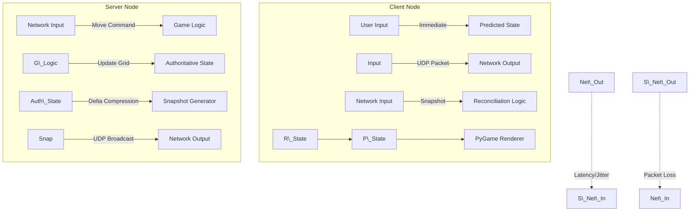

# Grid Clash: High-Performance UDP Multiplayer Game

**Grid Clash** is a real-time multiplayer arcade game built in Python. It serves as a comprehensive implementation of advanced networked game architecture, utilizing a custom UDP-based protocol (**GUDP**) to handle state synchronization, latency compensation, and bandwidth optimization.

This project demonstrates how to build a competitive networked game from scratch without relying on high-level networking engines, featuring client-side prediction, server reconciliation, and delta compression.

---

## 📖 Table of Contents

1. [Project Overview](https://www.google.com/search?q=%23-project-overview)
2. [System Architecture](https://www.google.com/search?q=%23-system-architecture)
3. [Key Features](https://www.google.com/search?q=%23-key-features)
4. [The GUDP Protocol](https://www.google.com/search?q=%23-the-gudp-protocol)
5. [Installation \& Requirements](https://www.google.com/search?q=%23-installation--requirements)
6. [Usage \& Controls](https://www.google.com/search?q=%23-usage--controls)
7. [Performance Analysis](https://www.google.com/search?q=%23-performance-analysis)
8. [Project Structure](https://www.google.com/search?q=%23-project-structure)

---

## 🔭 Project Overview

In **Grid Clash**, up to 4 players compete on a 20x20 grid. The objective is to claim cells by moving over them and stealing cells from opponents. The game ends when a player reaches 200 points or all cells are claimed.

The core challenge addressed by this project is maintaining a smooth gameplay experience over the internet. To achieve this, the system implements a custom reliability layer over UDP, ensuring that critical game events (like claiming a cell) are guaranteed, while movement data is transmitted rapidly with tolerance for packet loss.

---

## 🏗 System Architecture

The project follows a **Client-Server Authoritative** architecture. The server owns the "true" state of the game, while clients approximate that state to provide responsive feedback to the user.

### Data Flow Diagram



---

## 🌟 Key Features

### 1\. Robust UDP Implementation (GUDP)

Instead of TCP, this project uses raw UDP sockets for minimum latency. It implements a custom header structure `GUDP` (Gaming UDP) that handles:

* **Sequencing:** Discarding out-of-order packets.
* **Reliability:** A custom `SequenceManager` creates a "sliding window" to track packet loss and request retransmissions for critical messages.
* **Integrity:** CRC32 checksums ensure payload validity.

### 2\. Latency Compensation techniques

* **Client-Side Prediction:** The client moves the player immediately upon input without waiting for the server, preventing the feeling of "input lag".
* **Server Reconciliation:** When a server snapshot arrives, the client compares it to its predicted history. If a discrepancy is found (due to lag or collision), the client "rewinds" and replays inputs to correct the position.
* **Entity Interpolation:** Opponent movements are smoothed out using a linear interpolation buffer (100ms delay), preventing them from "teleporting" around the screen.

### 3\. Bandwidth Optimization

* **Delta Compression:** The server calculates the difference (delta) between the current frame and the previous frame. Only changed cells and positions are sent over the network.
* **Zlib Compression:** Large payloads (like full grid syncs) are compressed using `zlib` to reduce packet size.

---

## 📡 The GUDP Protocol

The communication relies on a custom binary header packed into every UDP datagram.

**Header Format (24 bytes):**

\*\*Header Format (24 bytes):\*\*
| Field | Type | Size | Description |
| :--- | :--- | :--- | :--- |
| \*\*Proto ID\*\* | `char\[4]` | 4B | Identifier `b'GUDP'` |
| \*\*Version\*\* | `uint8` | 1B | Protocol version (v2) |
| \*\*Msg Type\*\* | `uint8` | 1B | Enum (Move, Snapshot, Ack, etc.) |
| \*\*Snapshot ID\*\* | `uint32` | 4B | Global game state ID |
| \*\*Seq Num\*\* | `uint32` | 4B | Per-client packet sequence number |
| \*\*Timestamp\*\* | `uint64` | 8B | Unix timestamp (ms) for latency calc |
| \*\*Payload Len\*\*| `uint16` | 2B | Length of the data body |
| \*\*Checksum\*\* | `uint32` | 4B | CRC32 of the payload |

---

## 💻 Installation \& Requirements

### Prerequisites

* Python 3.8+
* The following Python libraries:

<!-- end list -->

```bash
pip install pygame pandas matplotlib scipy numpy psutil
```

### File Manifest

* `server.py`: The authoritative game server.
* `client.py`: The player client with prediction logic.
* `game.py`: Shared game logic and state management.
* `common.py`: Protocol definitions and constants.
* `baseline.py`: Automation script to launch server and bots.
* `process\_logs.py`: Analytical tool for generating performance graphs.

---

## 🎮 Usage \& Controls

### 1\. Manual Play

To play the game yourself:

1. **Start the Server:**

&nbsp;   ```bash
    python server.py
    ```

2. **Start a Client:**

&nbsp;   ```bash
    python client.py
    ```

   *Open multiple terminals and run `client.py` again to simulate multiple players.*

   ### 2\. Automated Stress Test

   To run a full simulation with 1 server and 4 automated "bot" clients:

   ```bash
   python baseline.py
   ```

   *Note: This script automatically handles process spawning and cleanup.*

   ### Controls

* **Arrow Keys:** Move Up, Down, Left, Right.
* **Spacebar:** Claim the cell you are standing on.
* **ESC:** Quit the game.

  ---

  ## 📊 Performance Analysis

  The project includes a sophisticated data analysis pipeline to measure network performance and synchronization accuracy.

  ### Generating Metrics

1. Run a game session (using `baseline.py` or manually).
2. The application generates CSV logs: `server\_position\_log.csv`, `client\_X\_metrics.csv`.
3. Run the analysis tool:

   &nbsp;   ```bash
       python process\_logs.py
       ```

   ### Visualizations

   The tool generates graphs to help tune network parameters (like `UPDATE\_HZ` in `common.py`).

   **1. Position Error vs. Update Rate**

* Analyzes the divergence between the server's true position and the client's displayed position.
* *Interpretation:* Higher update rates generally reduce error but increase bandwidth.

  **2. Latency \& Jitter Analysis**

* Tracks the round-trip time (RTT) and variance (jitter) for every packet.
* *Interpretation:* Spikes in this graph indicate network congestion or processing delays.

  ---

  ## 📂 Project Structure

  ```text
  /
  ├── baseline.py          # Orchestrator for running experiments
  ├── client.py            # Game client (PyGame, Prediction)
  ├── common.py            # Config, Constants, Protocol headers
  ├── game.py              # Core Logic (Movement, Collision, Events)
  ├── process\_logs.py      # Data Analysis \& Plotting
  ├── server.py            # UDP Server \& State Authority
  ├── server\_log.txt       # Runtime logs
  ├── \*.csv                # Generated metric data
  └── \*.png                # Generated analysis graphs
  ```

